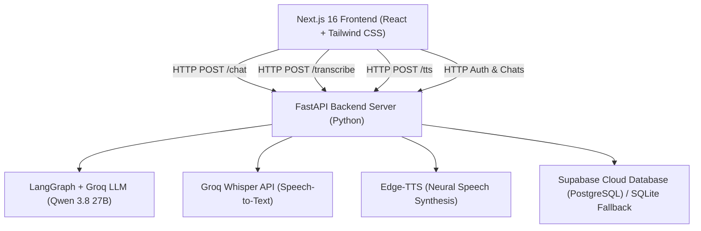
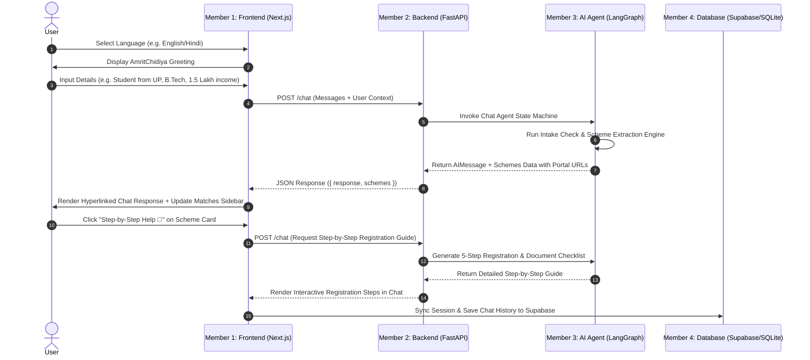

# 🦅 AmritChidiya (अमृतचिड़िया) — Comprehensive Project Documentation & Technical Architecture Handbook

> **Tagline:** *"Apni Sone Ki Chidiya Ko Phir Se Udaan Do"* 🇮🇳  
> **Mission:** Empowering every Indian citizen with instant, AI-guided access to official government schemes, scholarships, and welfare benefits in their native language through voice and text.

---

## 📋 Table of Contents
1. [Executive Summary & Vision](#1-executive-summary--vision)
2. [Core Features & Capabilities](#2-core-features--capabilities)
3. [System Architecture & Tech Stack](#3-system-architecture--tech-stack)
4. [Step-by-Step System Execution Flow](#4-step-by-step-system-execution-flow)
5. [Project Directory & File Structure](#5-project-directory--file-structure)
6. [Detailed 4-Member Role & Technical Responsibility Matrix](#6-detailed-4-member-role--technical-responsibility-matrix)
7. [Database & Supabase Integration](#7-database--supabase-integration)
8. [Setup & Installation Instructions](#8-setup--installation-instructions)

---

## 1. Executive Summary & Vision

Navigating Indian government welfare schemes and scholarships can be challenging due to language barriers, complex eligibility criteria, and confusing registration portals. **AmritChidiya** is a full-stack, AI-powered conversational platform that acts as a caring and empathetic digital companion.

It conducts natural conversations in **5 major Indian languages** (Hindi, Hinglish, English, Marathi, and Tamil), collects user profile context (age, state, income, category, academic goals), matches them with 100% eligible government schemes, provides direct text hyperlinks to official application sites, and guides them **step-by-step** through the registration process.

---

## 2. Core Features & Capabilities

### 🌐 1. Multilingual Support (5 Languages)
- Native conversational support for **Hindi, Hinglish, English, Marathi, and Tamil**.
- Automatic greeting initialization and prompt enforcement per language selection.

### 🎙️ 2. Hands-Free "Talk Mode" & HD Dictation
- **Groq Whisper Large v3 Integration**: High-definition speech-to-text with Indian accent phonetic verbatim transcription.
- **Edge-TTS Neural Voice Synthesis**: Natural voice playback tailored to Indian voice models (`hi-IN-SwaraNeural`, `en-IN-NeerjaNeural`, `mr-IN-AarohiNeural`, `ta-IN-PallaviNeural`).
- **Interactive Speech DSP**: Advanced noise filtering distinguishing human formants from ambient noise.

### 🎯 3. Custom Eligibility Scheme Match Engine
- Evaluates user age, state, annual family income, academic level (Class 10, 12, B.Tech, Graduate), and caste category (General, OBC, SC, ST).
- Filters out generic portals and identifies exact matching schemes (e.g. *UP Post Matric Scholarship*, *National Means-cum-Merit Scholarship*, *PM Kisan Samman Nidhi*, *PM Vishwakarma*, *Mahadbt*, etc.).

### 🔗 4. Hyperlinked Official Government Portals
- Scheme titles in both chat messages and the **Matches Sidebar** (desktop and mobile drawer) are rendered as text hyperlinks.
- Clicking a scheme match or **Apply Site 🔗** opens verified official portals (e.g. `scholarships.gov.in`, `scholarship.up.gov.in`, `pmkisan.gov.in`, `myscheme.gov.in`).

### 🚀 5. AI Step-by-Step Registration Assistance
- Dedicated **"Step-by-Step Help 🚀"** action button on every scheme match.
- Provides a structured 5-step registration breakdown:
  1. Direct official website link.
  2. Required documents checklist (Aadhaar, Bank Passbook, Income/Caste Certificates, Marksheets, Photo).
  3. Step-by-step online registration & account setup.
  4. Form filling & document uploading guidelines.
  5. Final submission, printout, and status tracking.

### 🔐 6. Supabase Cloud DB & Persistent History
- Cloud-hosted PostgreSQL storage via **Supabase Client API** (`supabase-py`).
- Automatic local SQLite fallback when offline or credentials absent.
- Guest preview mode with seamless auth-gating when schemes are matched.

---

## 3. System Architecture & Tech Stack



---

## 4. Step-by-Step System Execution Flow



---

## 5. Project Directory & File Structure

```
AmritChidiya/
├── backend/
│   ├── agents/
│   │   └── chat_agent.py          # LangGraph state graph, LLM invocation, & scheme extractor (Member 3)
│   ├── prompts/
│   │   └── system_prompt.py       # Core AI system prompt & phase rules (Member 3)
│   ├── amrit_chidiya.db           # SQLite database file fallback (Member 4)
│   ├── database.py                # Supabase Cloud & SQLite database CRUD operations (Member 4)
│   ├── main.py                    # FastAPI server entrypoint & REST API endpoints (Member 2)
│   └── requirements.txt           # Backend Python dependencies including supabase (Member 2)
├── frontend/
│   ├── app/
│   │   ├── globals.css            # Styling, custom scrollbars, animations (Member 1)
│   │   ├── layout.tsx             # Root React layout & metadata (Member 1)
│   │   └── page.tsx               # Main UI component (Chat, Sidebar, Matches, Talk Mode) (Member 1)
│   ├── components/
│   │   └── MarkdownContent.tsx    # Custom markdown renderer with hyperlinked <a> tags (Member 1)
│   ├── lib/
│   │   ├── auth.ts                # Client authentication & local/server chat storage (Member 4)
│   │   └── utils.ts               # Utility functions (Member 1)
│   └── package.json               # Frontend dependencies & scripts (Member 1)
├── PROJECT_DOCUMENTATION.md       # Comprehensive project documentation
├── TEAM_ROLES_DIVISION.md         # 4-member task & module responsibility matrix
└── README.md                      # Project overview & quick start guide
```

---

## 6. Detailed 4-Member Role & Technical Responsibility Matrix

### 👨‍💻 Member 1: Frontend UI/UX & Responsive Web Engineer
- **Core Files:** `frontend/app/page.tsx`, `frontend/components/MarkdownContent.tsx`, `frontend/app/globals.css`.
- **Key Responsibilities:**
  1. **Next.js 16 UI Architecture:** Client state machine managing message turns, scheme matches, language selection, and full-duplex voice Talk Mode.
  2. **Hyperlinked Markdown Component (`MarkdownContent.tsx`):** Renders gold-accented hyperlinks with `<ExternalLink />` icons and `target="_blank" rel="noopener noreferrer"`.
  3. **Matches Sidebar & Mobile Drawer:** Renders hyperlinked scheme cards with **Apply Site 🔗** and **Step-by-Step Help 🚀** buttons.
  4. **Talk Mode Modal:** Renders golden orb animations, live subtitle overlays, and microphone voice recording triggers.

### ⚙️ Member 2: Backend API & Speech Processing Lead
- **Core Files:** `backend/main.py`, `backend/requirements.txt`.
- **Key Responsibilities:**
  1. **FastAPI Endpoints:** Implements `/chat`, `/transcribe`, `/tts`, `/signup`, `/login`, and `/chats` routes.
  2. **Speech Recognition (`/transcribe`):** Receives WebM audio blobs, invokes Groq Whisper `whisper-large-v3`, and filters out room noise hallucinations.
  3. **Neural TTS Synthesis (`/tts`):** Cleans text via `clean_text_for_speech()`, maps language codes to Indian voice models (`hi-IN-SwaraNeural`, `en-IN-NeerjaNeural`, `mr-IN-AarohiNeural`, `ta-IN-PallaviNeural`), and streams audio.

### 🧠 Member 3: AI Agent, Prompt Engineering & Scheme Logic Lead
- **Core Files:** `backend/agents/chat_agent.py`, `backend/prompts/system_prompt.py`.
- **Key Responsibilities:**
  1. **System Prompt Architecture (`system_prompt.py`):** Enforces 5-language response policy, Phase 1 profile intake, Phase 2 hyperlinked scheme headers (`### 1. **[Scheme Name](URL)**`), Phase 3 5-step registration guides, and strict header formatting rules.
  2. **LangGraph Agent (`chat_agent.py`):** Builds state graph with model fallback chain (`qwen/qwen3.8-27b` -> `openai/gpt-oss-120b`).
  3. **Scheme Extraction Engine:** Regex scheme heading parser and comprehensive non-scheme title filters (`ignore_terms`, `ignore_substrings`).
  4. **Government Portal URL Resolver (`SCHEME_URL_MAP`):** Maps scheme names to verified portals (`scholarships.gov.in`, `scholarship.up.gov.in`, `pmkisan.gov.in`, `myscheme.gov.in`).

### 🔐 Member 4: Database, Auth Security & DevOps Lead
- **Core Files:** `backend/database.py`, `frontend/lib/auth.ts`, `backend/amrit_chidiya.db`.
- **Key Responsibilities:**
  1. **Supabase & SQLite Hybrid Database Architecture:** Manages `users` and `chats` tables on Supabase Cloud PostgreSQL with automatic local SQLite fallback.
  2. **Authentication & Hashing:** SHA-256 password hashing algorithm (`_hash_password`), user creation, and authentication checks.
  3. **Session Synchronization:** Client authentication service (`lib/auth.ts`) syncing local storage records with Supabase.
  4. **Guest Preview Gating & Deployment:** 4-message guest preview limit, auth-gating modal trigger, and Vercel/Render build optimization.

---

## 7. Database & Supabase Integration

The project uses **Supabase Cloud PostgreSQL** with automatic **SQLite fallback** in `backend/database.py`:
- `SUPABASE_URL` and `SUPABASE_KEY` configured in `backend/.env`.
- Database operations automatically attempt Supabase queries first, falling back to local `amrit_chidiya.db` SQLite database if offline.
- Included migration script: `backend/supabase_schema.sql` can be executed in the **Supabase Dashboard -> SQL Editor** to set up `users` and `chats` tables with indexes and Row Level Security (RLS) policies.

```sql
-- Create Users & Chats Tables in Supabase
CREATE TABLE IF NOT EXISTS public.users (
    id TEXT PRIMARY KEY,
    email TEXT UNIQUE NOT NULL,
    name TEXT NOT NULL,
    password_hash TEXT NOT NULL,
    created_at DOUBLE PRECISION NOT NULL DEFAULT extract(epoch from now())
);

CREATE TABLE IF NOT EXISTS public.chats (
    id TEXT PRIMARY KEY,
    user_id TEXT NOT NULL REFERENCES public.users(id) ON DELETE CASCADE,
    title TEXT NOT NULL,
    date TEXT NOT NULL,
    language TEXT NOT NULL,
    messages_json TEXT NOT NULL,
    schemes_json TEXT NOT NULL,
    updated_at DOUBLE PRECISION NOT NULL DEFAULT extract(epoch from now())
);
```

---

## 8. Setup & Installation Instructions

### 1. Backend Setup
```bash
cd backend
python -m venv .venv
source .venv/bin/activate  # On Windows: .venv\Scripts\activate
pip install -r requirements.txt
python main.py
```

### 2. Frontend Setup
```bash
cd frontend
npm install
npm run dev
```
Open [http://localhost:3000](http://localhost:3000) in your browser.
