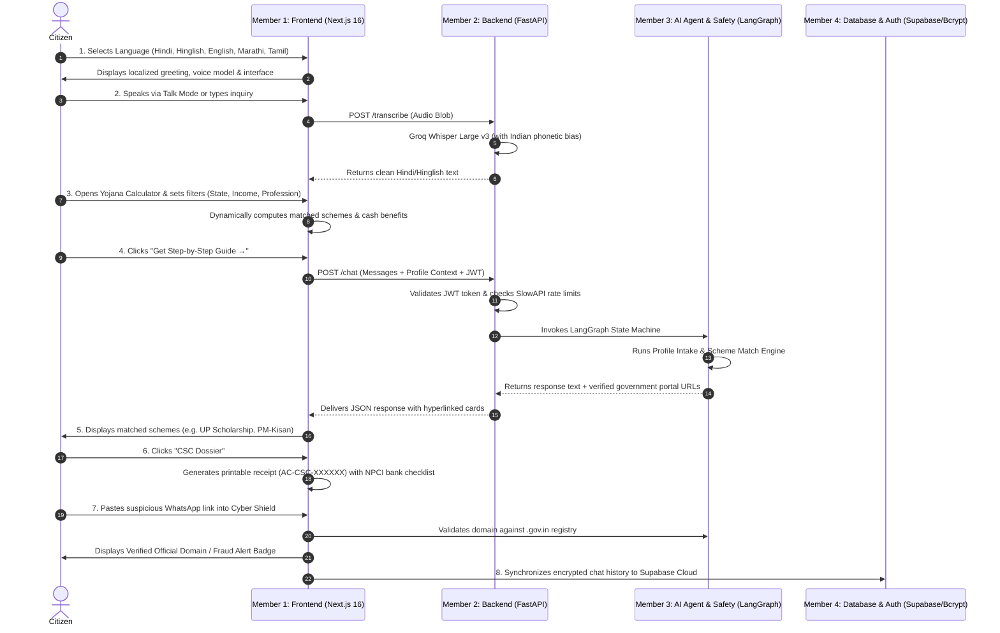
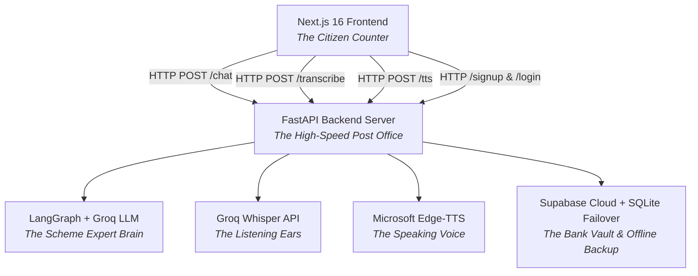
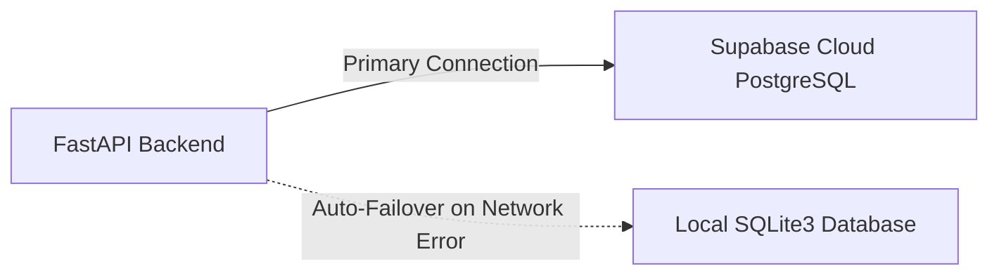

# 🦅 AmritChidiya (अमृतचिड़िया) — Comprehensive Technical Architecture Handbook

> **Tagline:** *"Apni Sone Ki Chidiya Ko Phir Se Udaan Do"* 🇮🇳  
> **Mission:** Empowering every Indian citizen with instant, AI-guided access to official government schemes, scholarships, and cyber safety tools in their native language through voice and text.  
> **Target Audience:** From fresh students and first-time coders to senior software architects and academic evaluators.

---

## 📋 Table of Contents
1. [Executive Summary & The Real-World Problem (Explained for Beginners)](#1-executive-summary--the-real-world-problem-explained-for-beginners)
2. [The Complete Citizen Journey: Step-by-Step Walkthrough](#2-the-complete-citizen-journey-step-by-step-walkthrough)
3. [System Architecture Demystified (Explained with Analogies)](#3-system-architecture-demystified-explained-with-analogies)
4. [4 Engineering Pillars & Individual Member USPs](#4-4-engineering-pillars--individual-member-usps)
5. [Step-by-Step Technical Deep Dive for Every Role](#5-step-by-step-technical-deep-dive-for-every-role)
6. [Core Technical Features & Capabilities Breakdown](#6-core-technical-features--capabilities-breakdown)
7. [Security & Database Architecture (Explained Simply)](#7-security--database-architecture-explained-simply)
8. [Technical Glossary for Beginners](#8-technical-glossary-for-beginners)
9. [Setup & Installation Instructions](#9-setup--installation-instructions)

---

## 1. Executive Summary & The Real-World Problem (Explained for Beginners)

Every year, the Government of India and state governments budget tens of thousands of crores of rupees for student scholarships, farmer income support, women empowerment programs, and healthcare subsidies. Yet, a vast percentage of eligible citizens never receive a single rupee. Why?

1. **Linguistic Exclusion:** Official government portals are predominantly in complex bureaucratic English or high formal Hindi. A rural villager or regional student speaking Marathi, Tamil, or everyday Hinglish cannot understand the application requirements.
2. **Opaque Multi-Factor Eligibility:** A student's eligibility depends on multiple intersecting criteria: Annual Family Income, State Domicile, Caste Category (General, OBC, SC, ST), Academic Year (10th pass, 12th pass, B.Tech), and Gender. Finding which exact scheme matches their profile requires days of manual research.
3. **The Last-Mile Digital Divide:** Millions of citizens in rural villages do not own laptops or printers. They must visit physical Common Service Centers (Jan Seva Kendra / Cyber Cafes) where operators often lack complete information or charge unnecessary fees.
4. **Rampant Cyber Fraud & Phishing:** Fraudulent WhatsApp forwards claiming *"Free Laptop Scheme 2026! Pay ₹299 to register"* cheat vulnerable families out of their hard-earned money.

**AmritChidiya (अमृतचिड़िया)** solves all four bottlenecks:
- Acts as a caring, multilingual companion that listens and speaks in **5 Indian languages** (Hindi, Hinglish, English, Marathi, Tamil).
- Uses an anti-hallucination AI engine and dynamic calculator to evaluate eligibility and estimate annual cash benefits.
- Protects citizens with a built-in **Cyber Shield** verifying official `.gov.in` and `.nic.in` domains.
- Outputs a physical, printable **CSC Scheme Dossier** with an NPCI bank checklist and an official operator stamp box for village cyber cafes.

---

## 2. The Complete Citizen Journey: Step-by-Step Walkthrough

Here is the exact step-by-step user journey from the moment a citizen opens AmritChidiya:


```mermaid
sequenceDiagram
    autonumber
    actor Citizen as Citizen
    participant FE as Member 1: Frontend (Next.js 16)
    participant BE as Member 2: Backend (FastAPI)
    participant Agent as Member 3: AI Agent & Safety (LangGraph)
    participant DB as Member 4: Database & Auth (Supabase/Bcrypt)

    Citizen->>FE: 1. Selects Language (Hindi, Hinglish, English, Marathi, Tamil)
    FE->>Citizen: Displays localized greeting, voice model & interface
    Citizen->>FE: 2. Speaks via Talk Mode or types inquiry
    FE->>BE: POST /transcribe (Audio Blob)
    BE->>BE: Groq Whisper Large v3 (with Indian phonetic bias)
    BE-->>FE: Returns clean Hindi/Hinglish text
    Citizen->>FE: 3. Opens Yojana Calculator & sets filters (State, Income, Profession)
    FE->>FE: Dynamically computes matched schemes & cash benefits
    Citizen->>FE: 4. Clicks "Get Step-by-Step Guide →"
    FE->>BE: POST /chat (Messages + Profile Context + JWT)
    BE->>BE: Validates JWT token & checks SlowAPI rate limits
    BE->>Agent: Invokes LangGraph State Machine
    Agent->>Agent: Runs Profile Intake & Scheme Match Engine
    Agent-->>BE: Returns response text + verified government portal URLs
    BE-->>FE: Delivers JSON response with hyperlinked cards
    FE->>Citizen: 5. Displays matched schemes (e.g. UP Scholarship, PM-Kisan)
    Citizen->>FE: 6. Clicks "CSC Dossier"
    FE->>FE: Generates printable receipt (AC-CSC-XXXXXX) with NPCI bank checklist
    Citizen->>FE: 7. Pastes suspicious WhatsApp link into Cyber Shield
    FE->>Agent: Validates domain against .gov.in registry
    FE->>Citizen: Displays Verified Official Domain / Fraud Alert Badge
    FE->>DB: 8. Synchronizes encrypted chat history to Supabase Cloud
```

---

## 3. System Architecture Demystified (Explained with Analogies)


```mermaid
graph TD
    Client["Next.js 16 Frontend<br><i>The Citizen Counter</i>"]
    API["FastAPI Backend Server<br><i>The High-Speed Post Office</i>"]
    LLM["LangGraph + Groq LLM<br><i>The Scheme Expert Brain</i>"]
    STT["Groq Whisper API<br><i>The Listening Ears</i>"]
    TTS["Microsoft Edge-TTS<br><i>The Speaking Voice</i>"]
    DB["Supabase Cloud + SQLite Failover<br><i>The Bank Vault & Offline Backup</i>"]

    Client -->|HTTP POST /chat| API
    Client -->|HTTP POST /transcribe| API
    Client -->|HTTP POST /tts| API
    Client -->|HTTP /signup & /login| API

    API --> LLM
    API --> STT
    API --> TTS
    API --> DB
```

- **Frontend (Next.js 16 + React 19) = "The Citizen Counter":**  
  The interactive touch screen where citizens type, click dropdowns, view scheme cards, and trigger prints.
- **Backend API (FastAPI) = "The High-Speed Post Office":**  
  Receives all incoming requests, routes voice recordings, verifies digital passes (JWT), enforces rate limits, and returns answers in milliseconds.
- **AI Core (LangGraph + Groq LLM) = "The Scheme Expert Brain":**  
  Follows a strict state machine to prevent making up fake schemes and determines exact eligibility.
- **Speech Engine (Groq Whisper + Microsoft Edge-TTS) = "The Ears and Voice":**  
  Listens with phonetic understanding of Indian regional dialects and speaks back in warm, natural neural voices.
- **Database & Security (Supabase + SQLite + Bcrypt) = "The Bank Vault & Backup Safe":**  
  Encrypts passwords with 12 rounds of cryptographic salt and keeps an instant offline replica running 24/7.

---

## 4. 4 Engineering Pillars & Individual Member USPs

Each team member is the sole technical owner of one critical department:

| Team Member | Engineering Role & Focus | Standout Member USP (Unique Selling Proposition) |
|---|---|---|
| **Member 1** | **Frontend UI/UX & Citizen Access Lead** | **Phygital Last-Mile Bridge & Citizen CSC Dossier Generator**<br>Bridges the digital-to-physical divide by generating structured, printable **CSC Scheme Dossiers** (`AC-CSC-XXXXXX`) with NPCI/DBT bank checklists & VLE operator sign-off boxes for village Jan Seva Kendras, coupled with a responsive Next.js 16 UI and hands-free Talk Mode. |
| **Member 2** | **Backend API & Speech Processing Lead** | **Low-Latency Vernacular Audio Pipeline with Indian Accent DSP**<br>Engineered an end-to-end voice pipeline using Groq Whisper Large v3 with phonetic domain bias for Indian accents, ambient silence/hallucination suppression, and high-fidelity Microsoft Edge-TTS neural streaming in 5 Indian languages. |
| **Member 3** | **AI Agent, Scheme Logic & Cyber Safety Lead** | **Anti-Hallucination Welfare Match Engine & Domain Cyber Shield**<br>Built the LangGraph dual-phase state machine that prevents welfare program hallucinations through strict intake rules, paired with the **Official Domain Shield & Scam Checker** that cryptographically verifies `.gov.in`/`.nic.in` domains to protect citizens from WhatsApp phishing. |
| **Member 4** | **Database, Auth Security & DevOps Lead** | **Zero-Trust Hybrid Cloud Persistence with Bcrypt Salted Auth**<br>Architected an enterprise-grade dual-database architecture with Supabase Cloud PostgreSQL and instant local SQLite failover, hardened by salted **Bcrypt (12 rounds)**, signed **24-hour JWT tokens**, SlowAPI rate limiting, and production CORS deployment. |

---

## 5. Step-by-Step Technical Deep Dive for Every Role

### 👨‍💻 Role 1: Frontend UI/UX & Citizen Access Lead (Member 1)
- **Concept in Plain Words:** Builds everything the citizen touches and sees, ensuring it runs smoothly on cheap smartphones and outputs physical paper receipts for rural citizens.
- **Step-by-Step Execution:**
  1. *State Management (`page.tsx`):* Coordinates conversational turns, language switches, speech audio states, and guest message limits.
  2. *Instant Yojana Calculator (`EligibilityCalculatorModal.tsx`):* Evaluates State, Category, Income, and Profession client-side in real-time, showing estimated annual benefit amounts (e.g. ₹30,000–₹55,000/yr). Clicking *"Get Step-by-Step Guide →"* passes user context directly to the chat companion.
  3. *Phygital CSC Dossier Engine (`CscDossierModal.tsx`):* Generates an official receipt (`AC-CSC-XXXXXX`) with applicant details, verified schemes, an NPCI/DBT bank checklist, and a physical VLE Operator stamp box with custom `@media print` CSS for standard A4 paper.
  4. *Safe Hyperlinks (`MarkdownContent.tsx`):* Formats markdown and ensures all government portal links open in new tabs with `target="_blank" rel="noopener noreferrer"`.
  5. *Hands-Free Talk Mode:* Features golden orb pulsing animations, live subtitles, and Web Audio API visualizers.

---

### ⚙️ Role 2: Backend API & Speech Processing Lead (Member 2)
- **Concept in Plain Words:** Builds the high-speed server and audio engine that listens to regional Indian accents, cleans up background noise, and speaks back naturally.
- **Step-by-Step Execution:**
  1. *Speech Recognition Pipeline (`/transcribe`):* Receives incoming WebM audio blobs $\rightarrow$ saves temporarily $\rightarrow$ calls Groq Whisper Large v3. Member 2 passes custom phonetic prompts of Indian states and scholarship terms to avoid misinterpretations.
  2. *Silence Hallucination Cleansing:* Whisper often hallucinates phrases like *"Thank you for watching"* during pauses. Member 2's code checks an exact blacklist of silence artifacts and strips them cleanly.
  3. *Speech Text Sanitizer (`clean_text_for_speech`):* Strips out asterisks, markdown headings, bullets, and URLs before passing text to the neural voice generator, producing natural, pause-free audio.
  4. *Neural Speech Streaming (`/tts`):* Uses Microsoft Edge-TTS with regional Indian neural voices (`hi-IN-SwaraNeural`, `mr-IN-AarohiNeural`, `ta-IN-PallaviNeural`, `en-IN-NeerjaNeural`).
  5. *FastAPI Routes & Security:* Hosts `/chat`, `/transcribe`, `/tts`, `/signup`, `/login`, enforces CORS origin regex (`^https://.*\.vercel\.app$`), and blocks DDoS attacks with SlowAPI.

---

### 🧠 Role 3: AI Agent, Scheme Logic & Cyber Safety Lead (Member 3)
- **Concept in Plain Words:** The government scheme expert and cyber detective who guarantees the AI never invents fake schemes and protects citizens from online scams.
- **Step-by-Step Execution:**
  1. *Phase 1 (Profile Intake):* If a student asks for a scholarship without giving their state, income, or category, the agent asks polite clarifying questions and suppresses scheme extraction.
  2. *Phase 2 (Eligibility Delivery):* Once details are complete, the LangGraph agent outputs verified scheme names formatted in structured markdown headers.
  3. *Government Portal URL Mapper (`SCHEME_URL_MAP`):* Maps scheme names directly to official government portals (`scholarships.gov.in`, `pmkisan.gov.in`, `scholarship.up.gov.in`).
  4. *Phase 3 (Step-by-Step Roadmap):* Delivers a 5-step registration breakdown with document requirements (Aadhaar, income certificate, bank passbook).
  5. *Cyber Shield Inspection (`ScamShieldModal.tsx`):* Parses user-submitted links, checks against trusted `.gov.in` and `.nic.in` domain patterns, flags suspicious TLDs (`.xyz`, `.top`), and educates citizens on the 3 Golden Rules.

---

### 🔐 Role 4: Database, Auth Security & DevOps Lead (Member 4)
- **Concept in Plain Words:** The bank vault keeper and infrastructure engineer who encrypts passwords, issues digital passes, and ensures the platform never crashes even if the cloud goes offline.
- **Step-by-Step Execution:**
  1. *Bcrypt Password Salting (`database.py`):* Replaced legacy fast hashes with slow, salted `bcrypt.hashpw` (rounds=12) to resist rainbow tables and brute-force attacks, with transparent on-the-fly migration for existing users.
  2. *Digital Wristbands (JWT Tokens):* Upon login, the backend issues an HS256 signed JWT token valid for 24 hours. The frontend attaches this token in the `Authorization: Bearer <token>` header for all private chat calls.
  3. *Dual-Database Failover:* Attempts to read/write from Supabase Cloud PostgreSQL. If network connectivity fails or credentials are absent, gracefully routes queries to local SQLite (`amrit_chidiya.db`) without throwing an unhandled exception.
  4. *SlowAPI Request Throttling:* Protects sensitive endpoints against credential stuffing and DoS attacks (5/min for signup, 10/min for login, 30/min for chat).
  5. *DevOps Deployment:* Manages environment variables on Render (Backend) and Vercel (Frontend), ensuring cross-cloud CORS works seamlessly.

---

## 6. Core Technical Features & Capabilities Breakdown

### 🧮 1. Yojana Eligibility Calculator (`EligibilityCalculatorModal.tsx`)
- Multi-factor evaluation matrix checking State, Category, Income, and Profession.
- Instant client-side score computation with estimated financial benefit figures.
- Dual-action buttons: direct *"Official Site"* link and *"Get Step-by-Step Guide →"* passing profile context into the conversational chat.

### 🛡️ 2. Official Domain Shield & Scam Checker (`ScamShieldModal.tsx`)
- Evaluates links and WhatsApp messages.
- Verifies genuine Indian central and state government domains (`.gov.in`, `.nic.in`).
- Flags phishing domains (`.xyz`, `.top`, `.online`), false registration fees, and warns citizens never to share Aadhaar OTPs.

### 📄 3. Phygital CSC Dossier & Application Receipt (`CscDossierModal.tsx`)
- Bridges Digital India to village Common Service Centers (Jan Seva Kendra / Cyber Cafes).
- Generates a formal, printable receipt (`AC-CSC-XXXXXX`) with applicant details, verified schemes, mandatory documents checklist (Aadhaar, NPCI/DBT bank passbook), and CSC VLE Operator verification stamp boxes.
- Custom print stylesheets (`window.print()`) formatted for standard A4 paper.

### 🎙️ 4. Vernacular Audio Pipeline & Talk Mode
- Full-duplex hands-free conversation powered by Groq Whisper Large v3 (sub-500ms transcription) with geographic phonetic prompts.
- Microsoft Edge-TTS neural speech synthesis across 5 Indian languages with real-time text sanitization.

### 🔐 5. Enterprise Security & Session Authorization
- Salted 12-round Bcrypt password encryption.
- Signed 24-hour HS256 JWT access tokens.
- SlowAPI request throttling and security headers middleware.
- Production CORS origin regex allowing secure communication between Vercel and Render.

---

## 7. Security & Database Architecture (Explained Simply)

### Hybrid Storage Model

```mermaid
graph LR
    BE["FastAPI Backend"]
    Supabase["Supabase Cloud PostgreSQL"]
    SQLite["Local SQLite3 Database"]

    BE -->|Primary Connection| Supabase
    BE -.->|Auto-Failover on Network Error| SQLite
```

- **Why Dual Database?** Supabase Cloud allows citizens to access their chat history from any device anywhere in the world. But in rural areas with spotty internet connectivity, the automatic SQLite fallback guarantees the platform continues running locally without throwing an error screen.
- **Why Bcrypt over SHA-256?** SHA-256 is designed to be fast, making it vulnerable to GPU brute-force attacks. Bcrypt is intentionally slow and salted, making rainbow table and brute-force attacks computationally unfeasible.
- **Why JWT Tokens?** Instead of re-checking user credentials on every single database request, the backend issues a signed cryptographic token that verifies the user's identity securely for 24 hours.

---

## 8. Technical Glossary for Beginners

| Term | What it Stands For | Beginner-Friendly Explanation |
|:---|:---|:---|
| **JWT** | JSON Web Token | A secure digital wristband issued upon login that proves who the user is without asking for their password again on every click. |
| **Bcrypt** | Password Hashing Function | A slow, salted cryptographic algorithm designed specifically to protect passwords from supercomputers and hackers. |
| **STT / TTS** | Speech-to-Text / Text-to-Speech | STT turns spoken voice into computer text. TTS turns computer text into a spoken human voice. |
| **CSC / VLE** | Common Service Center / Village Level Entrepreneur | Physical government assistance kiosks in Indian villages where citizens get digital certificates and welfare benefits processed. |
| **NPCI / DBT** | National Payments Corporation / Direct Benefit Transfer | The Indian government mechanism where welfare money is deposited directly into a citizen's bank account via Aadhaar. |
| **CORS** | Cross-Origin Resource Sharing | A browser security rule that controls whether a website hosted on Vercel is allowed to talk to a backend hosted on Render. |

---

## 9. Setup & Installation Instructions

### Local Development Setup
1. Clone the repository: `git clone https://github.com/ShreyRamola/AmritChidiya.git`
2. **Backend Server:**
   ```bash
   cd backend
   python -m venv .venv
   source .venv/bin/activate  # On Windows: .venv\Scripts\activate
   pip install -r requirements.txt
   python main.py
   ```
   *Runs on `http://127.0.0.1:8000`.*
3. **Frontend Application:**
   ```bash
   cd frontend
   npm install
   npm run dev
   ```
   *Runs on `http://localhost:3000`.*

### Production Cloud Deployment
- **Frontend (Vercel):** Deploy `frontend/` directory with environment variable `NEXT_PUBLIC_API_URL` pointing to the Render backend URL.
- **Backend (Render):** Deploy `backend/` web service with `ALLOWED_ORIGINS=https://amrit-chidiya.vercel.app`, `GROQ_API_KEY`, `JWT_SECRET_KEY`, and Supabase credentials.
- **Database (Supabase):** Run `supabase_schema.sql` in Supabase SQL Editor to initialize `users` and `chats` tables with Row Level Security (RLS) policies.
