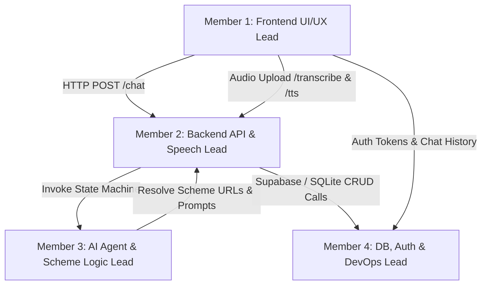

# 👥 AmritChidiya — Comprehensive 4-Member Team Role Division & Ownership Handbook

> **Project:** AmritChidiya (अमृतचिड़िया) — *"Apni Sone Ki Chidiya Ko Phir Se Udaan Do"* 🇮🇳  
> **Document Purpose:** Complete technical specification and task division breaking down codebase ownership, API contracts, components, and deliverables across 4 team members.

---

## 📊 Summary Responsibility Matrix

| Member | Primary Role | Codebase Ownership & Files | Key Deliverables & Systems |
|---|---|---|---|
| **Member 1** | **Frontend UI/UX & Responsive Design Lead** | `frontend/app/page.tsx` `frontend/components/MarkdownContent.tsx` `frontend/app/globals.css` | Next.js 16 UI, Glassmorphism CSS, Desktop Sidebars, Mobile Drawers, Hyperlinked Markdown Renderer, Talk Mode Modal |
| **Member 2** | **Backend API & Speech Processing Lead** | `backend/main.py` `backend/requirements.txt` Groq Whisper API & Edge-TTS | FastAPI REST Routes (`/chat`, `/transcribe`, `/tts`), Audio conversion pipeline, Speech DSP, Noise filtering |
| **Member 3** | **AI Agent, Prompt Engineering & Scheme Logic Lead** | `backend/agents/chat_agent.py` `backend/prompts/system_prompt.py` Scheme Extraction & URL Resolver | LangGraph state graph, Prompt design, Regex scheme extractor, Non-scheme filters, Government Portal URL Resolver |
| **Member 4** | **Database, Auth Security & DevOps Lead** | `backend/database.py` `frontend/lib/auth.ts` `backend/amrit_chidiya.db` | Supabase Cloud PostgreSQL, SQLite Fallback, Password Hashing (SHA-256), User Signup/Login, Chat Sync & Deployment |

---

## 👨‍💻 Member 1: Frontend UI/UX & Responsive Web Engineer

### 🎯 Primary Objective
Full ownership of the user interface, client-side state management, responsive drawer layouts, custom markdown rendering with hyperlinked portal links, and the interactive hands-free voice "Talk Mode" experience.

### 📁 Assigned Codebase Files
- [frontend/app/page.tsx](file:///c:/Users/shrey/Downloads/AmritChidiya%20%282%29/AmritChidiya/frontend/app/page.tsx) — Main page component, UI layout, state machine, event handlers.
- [frontend/components/MarkdownContent.tsx](file:///c:/Users/shrey/Downloads/AmritChidiya%20%282%29/AmritChidiya/frontend/components/MarkdownContent.tsx) — Custom markdown parser with hyperlinked `<a>` tags.
- [frontend/app/globals.css](file:///c:/Users/shrey/Downloads/AmritChidiya%20%282%29/AmritChidiya/frontend/app/globals.css) — Custom scrollbars, glassmorphism CSS utilities, golden orb animations.

---

## ⚙️ Member 2: Backend API & Speech Processing Lead

### 🎯 Primary Objective
Full ownership of the **FastAPI web server**, REST endpoints, speech-to-text (STT) transcription via Groq Whisper API, and neural text-to-speech (TTS) audio synthesis via Edge-TTS.

### 📁 Assigned Codebase Files
- [backend/main.py](file:///c:/Users/shrey/Downloads/AmritChidiya%20%282%29/AmritChidiya/backend/main.py) — FastAPI routes, CORS middleware, audio pipeline logic.
- [backend/requirements.txt](file:///c:/Users/shrey/Downloads/AmritChidiya%20%282%29/AmritChidiya/backend/requirements.txt) — Dependency management including `supabase`.

---

## 🧠 Member 3: AI Agent, Prompt Engineering & Scheme Logic Lead

### 🎯 Primary Objective
Full ownership of the **AI Intelligence Core**, state machine orchestration using LangGraph, system prompt design, regex scheme match extraction, non-scheme title filtering, and official government portal URL resolution.

### 📁 Assigned Codebase Files
- [backend/agents/chat_agent.py](file:///c:/Users/shrey/Downloads/AmritChidiya%20%282%29/AmritChidiya/backend/agents/chat_agent.py) — LangGraph state graph, LLM candidate fallback, `Scheme` schema, URL resolver map.
- [backend/prompts/system_prompt.py](file:///c:/Users/shrey/Downloads/AmritChidiya%20%282%29/AmritChidiya/backend/prompts/system_prompt.py) — SYSTEM_PROMPT rules, phase-based conversation workflow, hyperlinked scheme header template.

---

## 🔐 Member 4: Database, Auth Security & DevOps Lead

### 🎯 Primary Objective
Full ownership of the **Supabase Cloud Database architecture**, local SQLite fallback, user authentication security, password hashing, session synchronization, guest message limiting, and production deployment scripts.

### 📁 Assigned Codebase Files
- [backend/database.py](file:///c:/Users/shrey/Downloads/AmritChidiya%20%282%29/AmritChidiya/backend/database.py) — Supabase Client API connection manager, SQLite fallback manager, user authentication & chat session CRUD methods.
- [backend/supabase_schema.sql](file:///c:/Users/shrey/Downloads/AmritChidiya%20%282%29/AmritChidiya/backend/supabase_schema.sql) — Supabase PostgreSQL database table migration SQL script.
- [frontend/lib/auth.ts](file:///c:/Users/shrey/Downloads/AmritChidiya%20%282%29/AmritChidiya/frontend/lib/auth.ts) — Client authentication helper, local storage caching, backend API fetch wrappers.
- `backend/amrit_chidiya.db` — Local SQLite database file fallback.

### 🔍 Detailed Technical Responsibilities

#### 1. Supabase Cloud Database & SQLite Fallback (`database.py`)
- Initializes Supabase Client using `SUPABASE_URL` and `SUPABASE_KEY` from `backend/.env`.
- Automatically executes queries against Supabase PostgreSQL `users` and `chats` tables.
- Seamlessly falls back to local `amrit_chidiya.db` SQLite database when offline or if Supabase credentials are absent.

#### 2. Password Security & Authentication Pipeline
- Implements `_hash_password()` using SHA-256 hashing.
- Provides `create_user()` and `authenticate_user()` methods preventing duplicate accounts and securing credentials.

#### 3. Client Session & Local Storage Sync (`auth.ts`)
- Implements `getUserChatsAsync`, `saveUserChatAsync`, `deleteUserChatAsync` fetching server database records while maintaining local fallback cache in `localStorage`.
